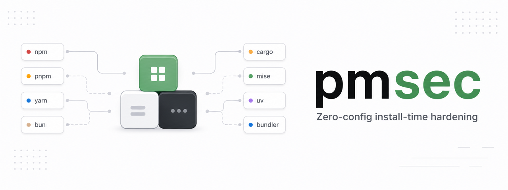

<p align="center">
  
</p>

<h1 align="center">pmsec</h1>

<p align="center">
  Zero-config install-time hardening for npm / pnpm / yarn / bun / cargo / mise / uv / bundler / aube.
</p>

<p align="center">
  <a href="https://www.npmjs.com/package/pmsec">npm</a> · <a href="https://pypi.org/project/pmsec/">PyPI</a> · <a href="bash/">bash</a> · <a href="powershell/">PowerShell</a>
</p>

```bash
npx pmsec
npx pmsec --check
uvx pmsec
uvx pmsec --check
```

```bash
curl -fsSL https://raw.githubusercontent.com/HikaruEgashira/pmsec/main/bash/pmsec \
  -o /usr/local/bin/pmsec && chmod +x /usr/local/bin/pmsec
pmsec
```

```powershell
$dest = Join-Path $env:USERPROFILE 'bin\pmsec.ps1'
New-Item -ItemType Directory -Path (Split-Path $dest) -Force | Out-Null
[Net.ServicePointManager]::SecurityProtocol = [Net.SecurityProtocolType]::Tls12
$ProgressPreference = 'SilentlyContinue'
Invoke-WebRequest -UseBasicParsing `
  -Uri https://raw.githubusercontent.com/HikaruEgashira/pmsec/main/powershell/pmsec.ps1 `
  -OutFile $dest
powershell.exe -ExecutionPolicy Bypass -File $dest
```

`pmsec` enables the hardening bundle for every detected tool. Use `--check` to
verify, `--disable` to remove, and `--doctor --json` to inspect paths and
writability.

Options: `--tool npm,pnpm,yarn,bun,cargo,mise,uv,bundler,aube`, `--days N`,
`--force`, `--json`.

Bootstrap through registries that already enforce cooldowns:

```bash
npx --registry=https://registry.npmjs.org/ --min-release-age=0 pmsec --check
uvx --index https://pypi.org/simple --exclude-newer-package pmsec=2099-01-01 pmsec --check
```

## Policy

| Tool | Config | Key | Value | Purpose | Min version |
| --- | --- | --- | --- | --- | --- |
| npm | `~/.npmrc` | `min-release-age` | `1` | 1-day publish cooldown | npm >= 11.10.0 |
| npm | `~/.npmrc` | `audit-level` | `high` | high+ advisories fail audit/install checks | npm >= 6.4.0 |
| npm | `~/.npmrc` | `allow-git` | `root` (`none` accepted) | no transitive git deps | npm >= 11.15.0 |
| npm | `~/.npmrc` | `allow-remote` | `root` (`none` accepted) | no transitive remote tarballs | npm >= 11.15.0 |
| npm | `~/.npmrc` | `allow-file` | `root` (`none` accepted) | no transitive `file:` deps | npm >= 11.15.0 |
| npm | `~/.npmrc` | `allow-directory` | `root` (`none` accepted) | no transitive local directories | npm >= 11.15.0 |
| pnpm | `~/.config/pnpm/rc` | `minimum-release-age` | `1440` | 1-day publish cooldown | pnpm >= 10.6.0 |
| pnpm | `~/.config/pnpm/rc` | `trust-policy` | `no-downgrade` | reject weaker provenance than prior install | pnpm >= 10.21.0 |
| pnpm | `~/.config/pnpm/rc` | `block-exotic-subdeps` | `true` | no transitive git/tarball deps | pnpm >= 10.26.0; default >= 11 |
| pnpm | `~/.config/pnpm/rc` | `strict-dep-builds` | `true` | unreviewed lifecycle scripts fail install | pnpm >= 10.3.0 |
| yarn | `~/.yarnrc.yml` | `npmMinimalAgeGate` | `"1d"` | 1-day publish cooldown | yarn >= 4.10.0 |
| yarn | `~/.yarnrc.yml` | `enableHardenedMode` | `true` | re-check lockfile resolutions | yarn >= 4.0.0 |
| yarn | `~/.yarnrc.yml` | `enableScripts` | `false` | disable third-party lifecycle scripts | yarn >= 4.0.0; default >= 4.14.0 |
| bun | `~/.bunfig.toml` | `[install].minimumReleaseAge` | `86400` | 1-day publish cooldown | bun >= 1.3.0 |
| bun | `~/.bunfig.toml` | `[install].ignoreScripts` | `true` | disable lifecycle scripts | bun >= 1.3.0 |
| cargo | `$CARGO_HOME/config.toml` | `[install].minimum-release-age` | `"1d"` | 1-day publish cooldown | cargo >= 1.94.0 |
| mise | `~/.config/mise/config.toml` | `[settings].minimum_release_age` | `"1d"` | 1-day release cooldown | mise >= 2026.4.22 |
| mise | `~/.config/mise/config.toml` | `[settings].paranoid` | `true` | always re-verify artifacts | current mise |
| mise | `~/.config/mise/config.toml` | `[settings].gpg_verify` | `true` | require GPG when available | current mise |
| mise | `~/.config/mise/config.toml` | `[settings].github_attestations` | `true` | verify GitHub attestations | mise >= 2025.12.12; default true |
| mise | `~/.config/mise/config.toml` | `[settings].slsa` | `true` | verify SLSA provenance | mise >= 2025.12; default true |
| uv | `~/.config/uv/uv.toml` | `exclude-newer` | `"1 days"` | 1-day publish cooldown | uv >= 0.9.17 |
| uv | `~/.config/uv/uv.toml` | `index-strategy` | `"first-index"` | avoid cross-index confusion | uv >= 0.1.0 |
| bundler | `~/.bundle/config` | `BUNDLE_COOLDOWN` | `"1"` | 1-day gem cooldown | bundler >= 4.0.13 |
| aube | `~/.config/aube/config.toml` | `minimumReleaseAge` | `1440` | 1-day publish cooldown | aube >= 1.0.0 |
| aube | `~/.config/aube/config.toml` | `paranoid` | `true` | strict-security bundle | aube >= 1.0.0 |

## Overrides

pmsec has two knobs: `--days N` and `--tool`. All other values are fixed, and
re-running `pmsec` restores them.

Relax policy in the project that needs it, not in pmsec:

| Tool | Project config |
| --- | --- |
| npm | `<project>/.npmrc` |
| pnpm | `<project>/.npmrc` / `pnpm-workspace.yaml` |
| yarn | `<project>/.yarnrc.yml` |
| bun | `<project>/bunfig.toml` |
| cargo | `<project>/.cargo/config.toml` |
| mise | `<project>/mise.toml` |
| uv | `<project>/pyproject.toml` (`[tool.uv]`) / `uv.toml` |
| bundler | `<project>/.bundle/config` |
| aube | `<project>/aube.toml` |

Example:

```ini
# <project>/.npmrc
allow-file=workspaces
```

Review checked-in tool configs before trusting an unfamiliar repo.
`pmsec --check` validates the user-global baseline only.

[MIT](LICENSE)
